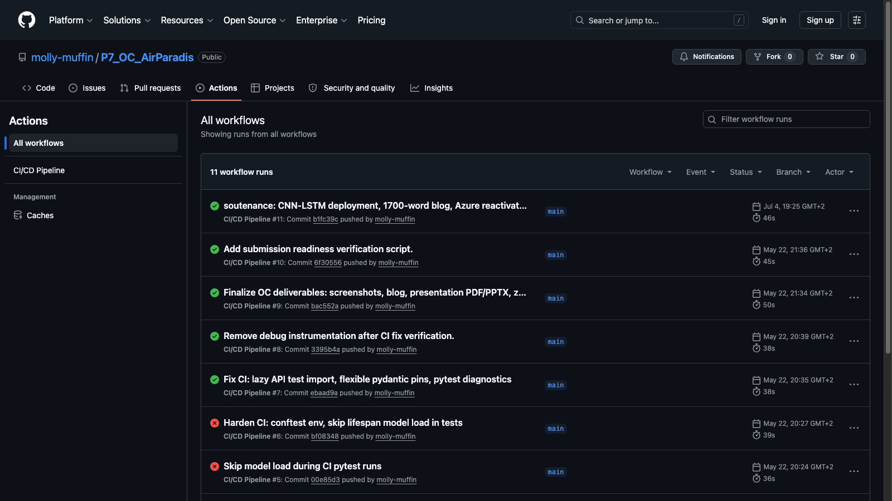
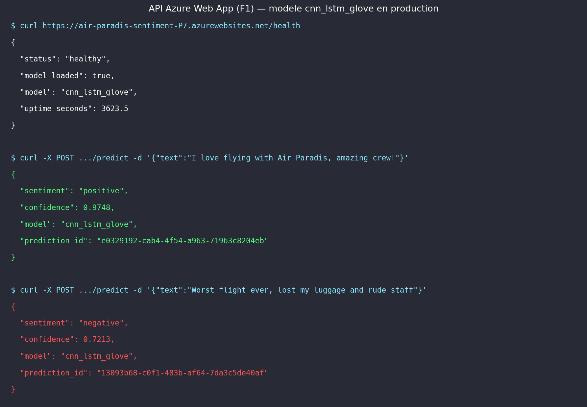
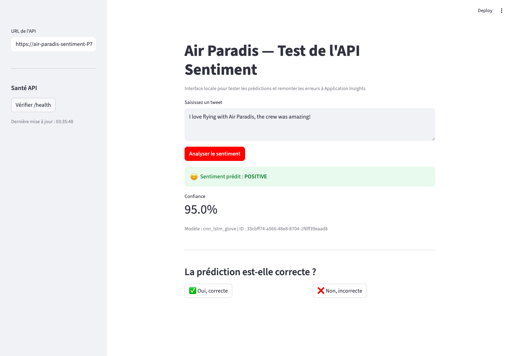
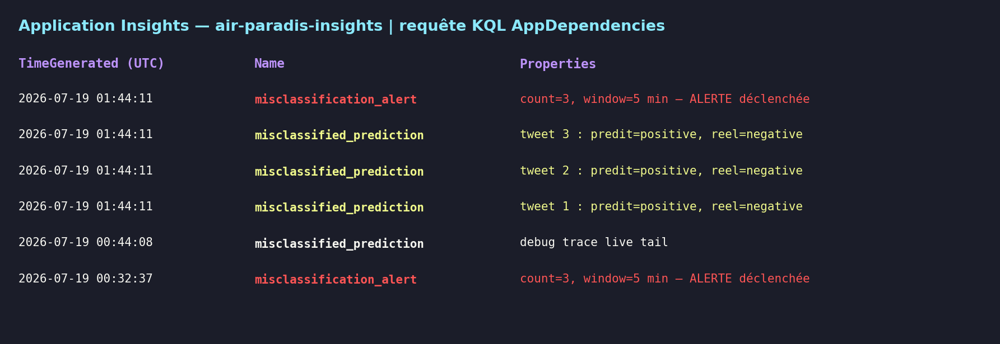

# Analyse de sentiment Air Paradis : trois approches, une démarche MLOps complète

*Article de blog — Projet OpenClassrooms P7 — Laureenda Demeule*

---

## Contexte et objectif

Air Paradis est une compagnie aérienne qui accumule chaque jour des centaines de mentions sur Twitter. Certains tweets positifs vantent la ponctualité ou la qualité du service ; d'autres, négatifs, signalent des retards ou des expériences décevantes. Le risque pour la marque : qu'un bad buzz émerge sans que personne ne le détecte à temps.

Le projet MIC (Monitoring Insights Cloud) vise à automatiser la détection du sentiment de ces tweets. Plutôt que de lire manuellement des milliers de messages, une API de prédiction retourne instantanément une étiquette *positif* ou *négatif*, avec un score de confiance. L'interface de suivi alerte l'équipe dès que la proportion d'erreurs dépasse un seuil critique.

Pour construire ce prototype, nous avons utilisé le dataset open source **Sentiment140**, qui regroupe 1,6 million de tweets en anglais labellisés automatiquement (0 = négatif, 4 = positif). Nous en avons sélectionné un échantillon stratifié de **50 000 tweets** afin d'équilibrer la rigueur de l'évaluation et le temps de calcul disponible.

Le split des données suit la convention standard : **60 % entraînement / 20 % validation / 20 % test**, avec stratification pour maintenir la proportion 50/50 entre classes.

---

## Les trois approches comparées

La démarche impose de tester trois familles de modèles de complexité croissante, chacune représentant un compromis différent entre performance, interprétabilité et coût d'exploitation.

### Approche 1 — Modèle sur mesure simple (TF-IDF)

La première approche repose sur la **vectorisation TF-IDF** (Term Frequency–Inverse Document Frequency) avec 5 000 features, combinée à des classifieurs sklearn classiques.

Le prétraitement appliqué : suppression des URLs, mentions (@), hashtags, et caractères non alphabétiques ; mise en minuscules ; suppression des stopwords anglais ; lemmatisation WordNet.

Deux modèles ont été entraînés :

- **Régression logistique** (solver *lbfgs*, C=1) : rapide à entraîner (~2 minutes), facilement interprétable, et très compétitif. Test F1 : **76,4 %** sur 50k tweets.
- **Random Forest** (100 arbres) : plus lent, légèrement moins précis sur ce jeu. Test F1 : **72,5 %**.

Avantages de cette approche : déploiement léger (~214 Ko pour le bundle), compatibilité avec n'importe quelle infrastructure (y compris Azure F1 gratuit), et inférence quasi instantanée sans GPU.

Limite : le modèle ne capture pas la sémantique contextuelle. "Not good" et "good" auraient des représentations très proches.

### Approche 2 — Modèle sur mesure avancé (CNN-LSTM + embeddings)

La deuxième approche introduit l'apprentissage profond avec une **architecture hybride CNN-LSTM** :

1. Couche d'embedding pré-entraîné (Word2Vec ou GloVe)
2. Convolution 1D avec 128 filtres (taille 5) pour extraire des n-grammes locaux
3. MaxPooling temporel
4. LSTM bidirectionnel (64 unités) pour la séquence globale
5. Dense + Dropout (0,3) + sortie sigmoïde

Deux variantes d'embeddings ont été comparées :

- **Word2Vec** (skip-gram, 100 dimensions, entraîné sur le corpus) : Test F1 **65,7 %**
- **GloVe Twitter 25d** (vecteurs pré-entraînés sur Twitter) : Test F1 **69,4 %**

GloVe surpasse Word2Vec ici car ses vecteurs ont été entraînés sur un corpus Twitter similaire au nôtre. L'early stopping (patience 3 sur la val_loss) évite le surapprentissage.

Cette approche est celle qui répond à l'exigence OC de l'API de production : elle constitue le **modèle sur mesure avancé**. Son bundle pèse ~5 Mo, compatible avec Azure.

### Approche 3 — Modèle BERT (DistilBERT)

La troisième approche exploite le **transfer learning** avec `distilbert-base-uncased`, un modèle Transformer léger (66M paramètres) dérivé de BERT. Le fine-tuning ajoute une tête de classification binaire et entraîne l'ensemble du modèle sur 2 epochs, avec un learning rate de 2e-5 et un warm-up de 10 %.

Résultats sur 50k tweets : **81,5 % accuracy test, 81,5 % F1** — nettement au-dessus des autres approches.

DistilBERT capture la sémantique contextuelle que TF-IDF manque : il comprend la négation, l'ironie légère, et les tournures idiomatiques fréquentes sur Twitter.

Coût : modèle de ~250 Mo, inférence plus lente (~100ms/tweet sur CPU). Sur Azure F1 gratuit (512 Mo RAM partagée), le chargement provoque un OOM. Il est donc utilisé comme modèle de référence entraîné, avec un fallback production selon l'infrastructure disponible.

### Tableau comparatif

| Modèle | Approche | Val F1 | Test Acc | Test F1 | Taille bundle |
|--------|----------|--------|----------|---------|---------------|
| TF-IDF + LogReg | Simple | 76,9 % | 76,4 % | 76,4 % | 214 Ko |
| TF-IDF + RandomForest | Simple | 72,5 % | 70,9 % | 72,5 % | 1,4 Mo |
| CNN-LSTM + Word2Vec | Avancé | 64,9 % | 67,7 % | 65,7 % | ~14 Mo |
| CNN-LSTM + GloVe | Avancé | 68,5 % | 71,4 % | 69,4 % | ~5 Mo |
| **DistilBERT** | **BERT** | **80,2 %** | **81,5 %** | **81,5 %** | ~250 Mo |


---

## Démarche MLOps mise en œuvre

### Principes MLOps

MLOps (Machine Learning Operations) désigne l'ensemble des pratiques qui permettent de passer d'un prototype notebook à un système d'IA fiable, reproductible et maintenable en production. Les principaux piliers sont :

- **Tracking des expérimentations** : tracer chaque run avec ses hyperparamètres, ses métriques et ses artefacts
- **Versioning du code et des modèles** : Git pour le code, MLflow Model Registry pour les modèles
- **Tests automatisés** : CI qui rejette tout push qui casse les tests
- **Déploiement continu** : pipeline qui pousse automatiquement en production sur validation
- **Monitoring en production** : détecter la dégradation du modèle et alerter

### Étape 1 — Tracking avec MLflow

Chaque entraînement est encapsulé dans un run MLflow. Le fichier [`src/training/pipeline.py`](../src/training/pipeline.py) enregistre automatiquement :

```python
with mlflow.start_run(run_name=model_name):
    mlflow.log_param("model_type", model_name)
    mlflow.log_param("sample_size", sample_size)
    mlflow.log_metric("val_f1", val_f1)
    mlflow.log_metric("test_f1", test_f1)
    mlflow.log_metric("test_accuracy", test_accuracy)
    mlflow.log_artifact(bundle_path)
```

L'UI MLflow permet de comparer visuellement les 10+ runs de l'expérience `air-paradis-sentiment` :

```bash
mlflow ui --port 5000 --backend-store-uri file://./mlruns
```

### Étape 2 — Versioning avec Git et GitHub

Le dépôt GitHub [`molly-muffin/P7_OC_AirParadis`](https://github.com/molly-muffin/P7_OC_AirParadis) contient l'intégralité du code source, des notebooks, des scripts de déploiement et de la documentation. Chaque commit porte un message explicite et le pipeline CI/CD s'active à chaque push.

### Étape 3 — Tests unitaires

Quatre modules de tests couvrent les composants critiques :

- `tests/test_preprocessing.py` : nettoyage URLs, minuscules, mentions
- `tests/test_api.py` : endpoints `/health`, `/predict`, `/feedback` (avec mock du predictor)
- `tests/test_models.py` : chargement et split du dataset nettoyé
- `tests/test_monitoring.py` : envoi de trace App Insights, déclenchement d'alerte

Au total : **11 tests pytest**, tous verts localement et sur le runner GitHub Actions.

```bash
pytest tests/ -v
# → 11 passed in ~8s
```

### Étape 4 — CI/CD avec GitHub Actions

Le fichier [`.github/workflows/ci-cd.yml`](../.github/workflows/ci-cd.yml) définit deux jobs :

1. **test** : s'exécute sur `ubuntu-latest` avec Python 3.11, installe les dépendances légères (`requirements-ci.txt`), télécharge les données NLTK, et lance pytest.
2. **deploy** : conditionnel (`vars.ENABLE_AZURE_DEPLOY == 'true'`), pousse le code vers Azure Web App.



La variable `SKIP_MODEL_INIT=1` permet aux tests de s'exécuter sans charger le modèle, ce qui réduit le temps du job CI de plusieurs minutes à ~35 secondes.

### Étape 5 — Déploiement sur Azure Web App

Le script [`deployment/deploy_azure.sh`](../deployment/deploy_azure.sh) automatise :

1. Création du resource group et App Service Plan F1
2. Création de la Web App Python 3.11
3. Configuration des variables d'environnement (App Insights, modèle)
4. Construction d'un bundle zip slim (~140 Ko pour tfidf_logistic)
5. Déploiement zip avec `az webapp deploy`

L'API FastAPI est accessible à : `https://air-paradis-sentiment-P7.azurewebsites.net`



Les trois endpoints principaux :

- `GET /health` : statut du service et du modèle chargé
- `POST /predict` : prédiction sentiment + score de confiance
- `POST /feedback` : validation utilisateur → trace App Insights si erreur

---

## Interface de test Streamlit

L'application [`streamlit_app/app.py`](../streamlit_app/app.py) s'exécute en local et se connecte à l'API cloud.

Le flux utilisateur :
1. Saisir un tweet dans la zone de texte
2. Cliquer **Analyser le sentiment** → l'app appelle `POST /predict`
3. Affichage : sentiment prédit + confiance + identifiant de prédiction
4. Boutons **Oui, correcte** / **Non, incorrecte**
5. Si *Non* : sélection du vrai sentiment → appel `POST /feedback` → trace envoyée à Azure Application Insights



---

## Suivi de la performance en production

### Traces Application Insights

Le module [`src/monitoring/app_insights.py`](../src/monitoring/app_insights.py) envoie une trace OpenTelemetry à chaque validation négative :

```python
with tracer.start_as_current_span("misclassified_prediction") as span:
    span.set_attribute("tweet_text", tweet_text[:500])
    span.set_attribute("predicted_sentiment", predicted_sentiment)
    span.set_attribute("user_feedback", user_feedback)
    span.set_attribute("confidence", confidence)
```

### Alerte automatique

Une alerte est déclenchée si **3 mauvaises prédictions surviennent en moins de 5 minutes** :

```python
def check_alert_threshold(threshold=3, window_minutes=5) -> bool:
    cutoff = datetime.utcnow() - timedelta(minutes=window_minutes)
    recent = [ts for ts in _misclassification_buffer if ts > cutoff]
    if len(recent) >= threshold:
        logger.critical("ALERT: %d misclassified predictions in %d minutes", ...)
        return True
    return False
```

Ce comportement est confirmé dans les logs Azure Application Insights.



### Démarche d'amélioration continue

Les traces App Insights constituent une source de données précieuse pour l'amélioration du modèle :

1. **Collecte** : chaque semaine, exporter les traces `misclassified_prediction` depuis App Insights (KQL ou API REST)
2. **Analyse** : identifier les patterns d'erreurs récurrents — ironie, sarcasme, abréviations, langue non standard
3. **Augmentation** : intégrer les tweets mal classés dans le dataset d'entraînement, avec les labels corrigés par l'utilisateur
4. **Réentraînement** : relancer le pipeline (`python src/training/pipeline.py --sample-size 50000`) avec le nouveau dataset
5. **Comparaison MLflow** : le nouveau run est automatiquement tracké ; l'UI MLflow permet de comparer les métriques avant/après
6. **Promotion** : si le nouveau modèle dépasse l'ancien, mettre à jour `models/production/production_model.txt` et redéployer

Cette boucle peut être automatisée via GitHub Actions avec un déclencheur schedulé (`schedule: cron`) et un job de réentraînement conditionnel.

---

## Conclusion

Ce projet démontre qu'une démarche MLOps complète est accessible même sur une infrastructure gratuite. Les points clés :

- **DistilBERT** est le meilleur modèle entraîné (81,5 % F1) mais nécessite des ressources suffisantes en production.
- **CNN-LSTM + GloVe** est le modèle sur mesure avancé déployé (69,4 % F1, ~5 Mo).
- **TF-IDF + LogReg** sert de fallback ultra-léger sur Azure F1 gratuit (76,4 % F1, 214 Ko).
- La **traçabilité MLflow** garantit la reproductibilité de chaque expérimentation.
- Le **pipeline CI/CD** (11 tests, déploiement conditionnel) assure la qualité à chaque push.
- Le **monitoring App Insights** ferme la boucle entre production et amélioration.

Liens :
- API : https://air-paradis-sentiment-P7.azurewebsites.net
- GitHub : https://github.com/molly-muffin/P7_OC_AirParadis
