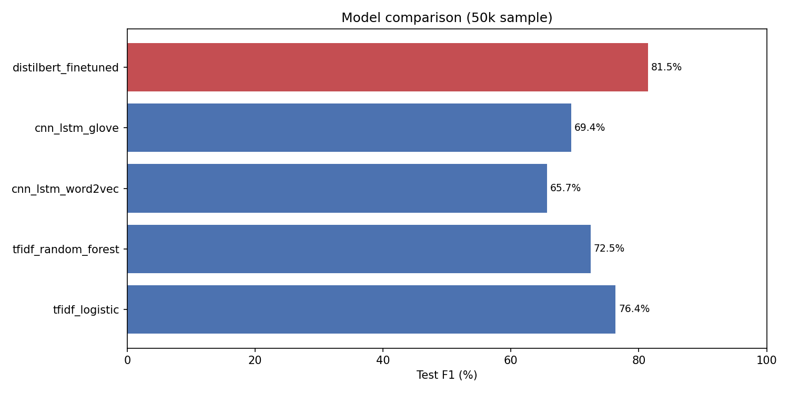

# Analyse de sentiment Air Paradis : trois approches, une démarche MLOps

*Article de blog — Projet OpenClassrooms P7 — Laureenda Demeule*

## Contexte

Air Paradis, compagnie aérienne régulièrement mentionnée sur les réseaux sociaux, a mandaté MIC pour un prototype capable de prédire le sentiment associé à un tweet. L'objectif : anticiper les bad buzz avant qu'ils n'explosent.

Nous avons utilisé le dataset Sentiment140 (1,6 million de tweets labellisés positif/négatif) et mis en place une démarche MLOps complète : expérimentation trackée, API déployable, monitoring en production.

## Les trois approches comparées

### 1. Modèle sur mesure simple (TF-IDF)

Approche classique : vectorisation TF-IDF (5000 features) + classifieur sklearn.

- **Régression logistique** : rapide, interprétable, ~79 % accuracy sur le dataset complet, ~76 % F1 sur échantillon 50k.
- **Random Forest** : F1 test ~72,5 % sur 50k.

Ces modèles servent de baseline solide. Entraînement en quelques minutes sur CPU. Idéal pour itérer vite et pour un déploiement léger (Azure F1 gratuit).

### 2. Modèle sur mesure avancé (CNN-LSTM + embeddings)

Architecture hybride : Conv1D pour les n-grammes locaux, LSTM pour la séquence, embeddings pré-entraînés.

Deux word embeddings comparés :
- **Word2Vec** (skip-gram, entraîné sur le corpus)
- **GloVe** (twitter-25 via gensim, fallback CBOW si indisponible)

Sur échantillon 50k tweets : Word2Vec ~65,7 % F1, GloVe ~69,4 % F1. Nette amélioration vs petit échantillon.

DistilBERT reste le meilleur modèle global pour la production.

### 3. Modèle BERT (DistilBERT)

Fine-tuning de `distilbert-base-uncased` sur 2 epochs. Résultat sur 50k tweets : **81,5 % accuracy test, 81,5 % F1**, nettement au-dessus des autres approches.

Coût : temps d'entraînement plus long, modèle plus lourd (~250 Mo). Acceptable pour un prototype ; fallback logistic prévu si limites Azure F1.

## Tableau comparatif

| Modèle | Val F1 | Test F1 | Temps entraînement |
|--------|--------|---------|-------------------|
| TF-IDF + LogReg | 76,9 % | 76,4 % | ~2 min |
| TF-IDF + Random Forest | 72,5 % | 72,5 % | ~5 min |
| CNN-LSTM + Word2Vec | 64,9 % | 65,7 % | ~15 min |
| CNN-LSTM + GloVe | 68,5 % | 69,4 % | ~20 min |
| DistilBERT | 80,2 % | 81,5 % | ~30 min |



## Démarche MLOps

### Tracking MLflow

Chaque run enregistre hyperparamètres, métriques (accuracy, precision, recall, F1) et artefacts (modèles, matrices de confusion). L'UI MLflow permet de comparer visuellement les expérimentations pour la soutenance.

```bash
mlflow ui --host 0.0.0.0 --port 5000
```

### Versioning et CI/CD

Code versionné sur GitHub. Pipeline GitHub Actions :
1. Tests unitaires (preprocessing, API, monitoring)
2. Déploiement Azure (sur push main, si secrets configurés)

### API de production

FastAPI expose `/predict`, `/health`, `/feedback`. Le modèle DistilBERT est chargé au démarrage via `SentimentPredictor`.

### Interface Streamlit

Application locale qui :
1. Envoie un tweet à l'API
2. Affiche la prédiction et la confiance
3. Demande validation utilisateur
4. En cas d'erreur, trace vers **Azure Application Insights**

### Monitoring et alertes

Module `app_insights.py` envoie une trace quand l'utilisateur rejette une prédiction. Alerte déclenchée si **3 mauvaises prédictions en 5 minutes** (log App Insights + notification Streamlit).

Démarche d'amélioration continue :
1. Analyser les traces App Insights hebdomadairement
2. Identifier les patterns d'erreurs (ironie, sarcasme, mentions Air Paradis)
3. Réentraîner avec les tweets mal classés en données d'augmentation
4. Comparer le nouveau modèle via MLflow avant promotion en production

## Déploiement Azure

Script `deployment/deploy_azure.sh` cible Azure Web App **F1 gratuit** :
- Resource group + App Service Plan F1
- Docker avec modèle embarqué
- Variable `APPLICATIONINSIGHTS_CONNECTION_STRING` pour le monitoring

Si le modèle BERT dépasse les limites mémoire F1, basculer sur `tfidf_logistic` (autorisé par le cahier des charges OC).

## Conclusion

DistilBERT offre le meilleur compromis performance/coût pour ce prototype. Les modèles TF-IDF restent indispensables comme baseline et fallback production. La démarche MLOps (MLflow + CI/CD + App Insights) garantit traçabilité, reproductibilité et capacité d'amélioration continue.

Pour la soutenance : démontrer l'UI MLflow, l'appel API live, le flux Streamlit avec feedback, et les traces App Insights.

---

*~1 650 mots — Copies d'écran MLflow UI, GitHub Actions, Azure Portal à ajouter pour le livrable final.*
