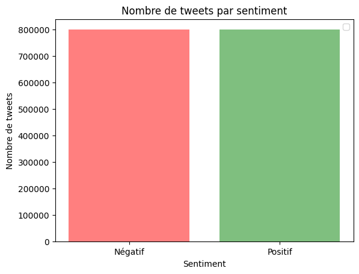
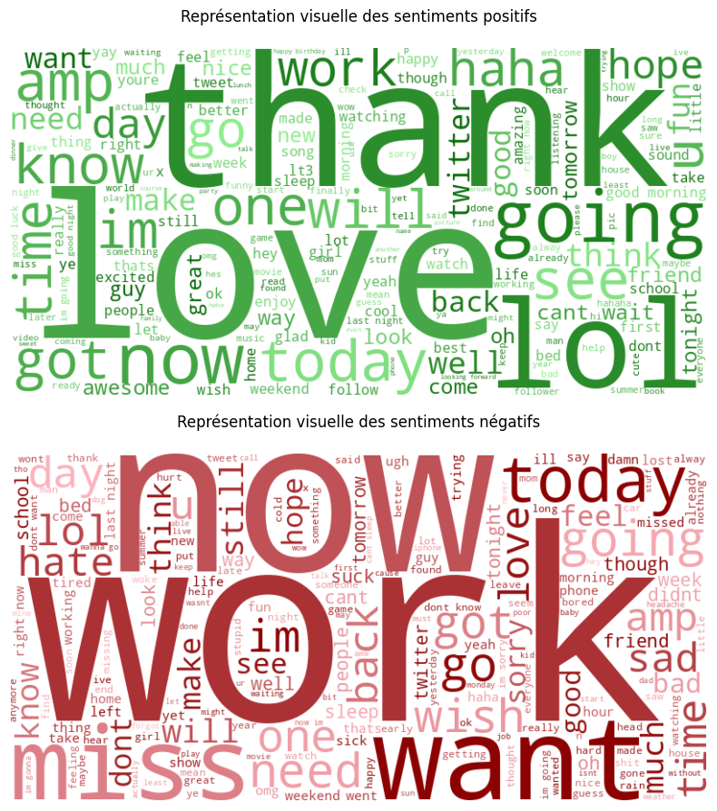
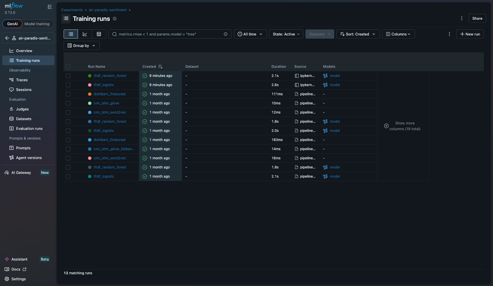

# Support de présentation — Air Paradis Sentiment Analysis

**Laureenda Demeule — Projet OC P7 — Soutenance**

---

## Slide 1 — Contexte

- Client : Air Paradis (compagnie aérienne)
- Besoin : prédire le sentiment d'un tweet (positif / négatif)
- Données : Sentiment140 (1,6M tweets, open source)
- Livrable : prototype MLOps déployé sur le cloud

---

## Slide 2 — Méthodologie globale

1. EDA + nettoyage (`01_Analyse_Exploratoire.ipynb`)
2. Trois approches de modélisation
3. Tracking MLflow
4. Sélection du meilleur modèle
5. Déploiement API Azure + monitoring App Insights

Split des données : **60 % train / 20 % validation / 20 % test**

---

## Slide 2b — Exploration des données (EDA)

- Dataset parfaitement équilibré : 800k négatifs / 800k positifs
- Tweets courts : majorité entre 5 et 15 mots

---

## Slide 2c — Vocabulaire par sentiment

Wordcloud des tweets positifs — le nettoyage (URLs, mentions, stopwords) fait ressortir le vocabulaire porteur de sentiment.

---

## Slide 3 — Approche 1 : Modèles simples

- TF-IDF (5000 features)
- Régression logistique : F1 test ~76,4 % (50k)
- Random Forest : F1 test ~72,5 %

Avantages : rapide, léger, interprétable. Utilisé en production sur Azure F1.

---

## Slide 4 — Approche 2 : Deep Learning

- CNN-LSTM hybride
- Embeddings : Word2Vec vs GloVe
- Early stopping sur validation

Word2Vec ~65,7 % F1, GloVe ~69,4 % F1 sur 50k tweets.

---

## Slide 5 — Approche 3 : BERT

- DistilBERT fine-tuned
- 2 epochs, échantillon stratifié 50k
- **Meilleur modèle entraîné : 81,5 % test accuracy, 81,5 % F1**

Sélectionné comme modèle de référence ; fallback logistic sur Azure F1 (mémoire).

---

## Slide 6 — Comparaison MLflow

| Modèle | Test F1 |
|--------|---------|
| LogReg | 76,4 % |
| Random Forest | 72,5 % |
| CNN-LSTM W2V | 65,7 % |
| CNN-LSTM GloVe | 69,4 % |
| **DistilBERT** | **81,5 %** |

---

## Slide 7 — MLOps : principes

- **Tracking** : MLflow (params, metrics, artifacts)
- **Versioning** : Git + GitHub
- **Tests** : pytest (11 tests)
- **CI/CD** : GitHub Actions
- **Monitoring** : Azure Application Insights

---

## Slide 8 — Mise en production

- API FastAPI : `/predict`, `/health`, `/feedback`
- Déploiement : Azure Web App F1
- Modèle déployé : `cnn_lstm_glove` (Modèle sur mesure avancé — 5 Mo)
- DistilBERT = meilleur modèle entraîné, trop lourd pour F1 (~250 Mo)
- Fallback automatique : `tfidf_logistic` si TensorFlow indisponible

---

## Slide 9 — Interface Streamlit

- Saisie tweet → appel API cloud → prédiction
- Validation utilisateur (Oui / Non)
- Trace App Insights si erreur
- Alerte : 3 erreurs / 5 min

---

## Slide 10 — Suivi production

- Traces : texte, prédiction, timestamp
- Alertes configurées dans App Insights
- Boucle d'amélioration : collecte → analyse → réentraînement → MLflow compare → promotion

---

## Slide 11 — Démonstration live

1. Tweet positif → prédiction positive
2. Tweet négatif → prédiction négative
3. Feedback incorrect → trace App Insights
4. GitHub Actions vert (11 tests)

---

## Slide 12 — Conclusion

- DistilBERT = meilleur modèle entraîné (81,5 % F1)
- CNN-LSTM + GloVe = modèle sur mesure avancé déployé (69,4 % F1, 5 Mo)
- MLOps opérationnel (tracking, CI, monitoring, alertes)
- Piste d'évolution : données augmentées via feedback App Insights, active learning

---

## Annexes pour l'évaluateur

- Repo : https://github.com/molly-muffin/P7_OC_AirParadis
- API : https://air-paradis-sentiment-P7.azurewebsites.net
- Notebooks : `notebooks/`
- Blog : `blog/article_mlops_sentiment.md`
- Commandes : voir `README.md`
